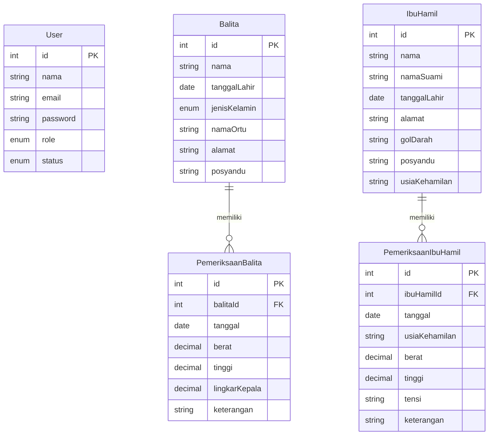

# Dokumentasi REST API — Sistem Informasi Posyandu RW 11

## Entitas / Model Data

### 1. User

| Field | Tipe | Keterangan |
|-------|------|------------|
| `id` | int (PK) | Auto-increment |
| `nama` | string | Required |
| `email` | string | Required, unique |
| `password` | string | Hashed, required |
| `role` | enum | `Admin` / `Kader` / `Bidan` |
| `status` | enum | `Aktif` / `Nonaktif` |
| `createdAt` | datetime | Timestamp dibuat |
| `updatedAt` | datetime | Timestamp diperbarui |

### 2. Balita

| Field | Tipe | Keterangan |
|-------|------|------------|
| `id` | int (PK) | Auto-increment |
| `nama` | string | Required |
| `tanggalLahir` | date | Required |
| `jenisKelamin` | enum | `Laki-laki` / `Perempuan` |
| `namaOrtu` | string | Required |
| `alamat` | string | Optional |
| `posyandu` | string | Nama posyandu |
| `createdAt` | datetime | Timestamp dibuat |
| `updatedAt` | datetime | Timestamp diperbarui |

### 3. IbuHamil

| Field | Tipe | Keterangan |
|-------|------|------------|
| `id` | int (PK) | Auto-increment |
| `nama` | string | Required |
| `namaSuami` | string | Required |
| `tanggalLahir` | date | Untuk menghitung umur |
| `alamat` | string | Optional |
| `golDarah` | string | `A` / `B` / `AB` / `O` |
| `posyandu` | string | Nama posyandu |
| `usiaKehamilan` | string | Cth: "7 bulan" |
| `createdAt` | datetime | Timestamp dibuat |
| `updatedAt` | datetime | Timestamp diperbarui |

### 4. PemeriksaanBalita

| Field | Tipe | Keterangan |
|-------|------|------------|
| `id` | int (PK) | Auto-increment |
| `balitaId` | int (FK) | Relasi ke tabel Balita |
| `tanggal` | date | Tanggal pemeriksaan |
| `berat` | decimal | Berat badan dalam kg |
| `tinggi` | decimal | Tinggi badan dalam cm |
| `lingkarKepala` | decimal | Lingkar kepala dalam cm |
| `keterangan` | string | `Normal` / `Berat kurang` / dll |
| `createdAt` | datetime | Timestamp dibuat |
| `updatedAt` | datetime | Timestamp diperbarui |

### 5. PemeriksaanIbuHamil

| Field | Tipe | Keterangan |
|-------|------|------------|
| `id` | int (PK) | Auto-increment |
| `ibuHamilId` | int (FK) | Relasi ke tabel IbuHamil |
| `tanggal` | date | Tanggal pemeriksaan |
| `usiaKehamilan` | string | Cth: "28 minggu" |
| `berat` | decimal | Berat badan dalam kg |
| `tinggi` | decimal | Tinggi badan dalam cm |
| `tensi` | string | Cth: "120/80" |
| `keterangan` | string | `Normal` / `Tensi tinggi` / dll |
| `createdAt` | datetime | Timestamp dibuat |
| `updatedAt` | datetime | Timestamp diperbarui |

---

## Relasi Data

```
User (standalone — tidak berelasi dengan tabel lain)

Balita ──< PemeriksaanBalita      (1 balita memiliki banyak pemeriksaan)
IbuHamil ──< PemeriksaanIbuHamil  (1 ibu hamil memiliki banyak pemeriksaan)
```

### ERD (Entity Relationship Diagram)



---

## Endpoint API

### Auth

| Method | Endpoint | Kegunaan |
|--------|----------|----------|
| `POST` | `/api/auth/login` | Login user |
| `POST` | `/api/auth/logout` | Logout user |

### User

| Method | Endpoint | Kegunaan |
|--------|----------|----------|
| `GET` | `/api/users` | List semua user |
| `POST` | `/api/users` | Tambah user baru |
| `PUT` | `/api/users/:id` | Edit data user |
| `DELETE` | `/api/users/:id` | Hapus user |

### Balita

| Method | Endpoint | Kegunaan |
|--------|----------|----------|
| `GET` | `/api/balita` | List semua balita |
| `GET` | `/api/balita/:id` | Detail balita beserta info |
| `POST` | `/api/balita` | Tambah data balita baru |
| `PUT` | `/api/balita/:id` | Edit data balita |
| `DELETE` | `/api/balita/:id` | Hapus data balita |

### Pemeriksaan Balita

| Method | Endpoint | Kegunaan |
|--------|----------|----------|
| `GET` | `/api/pemeriksaan-balita` | List semua pemeriksaan balita |
| `GET` | `/api/balita/:id/pemeriksaan` | Riwayat pemeriksaan per balita |
| `POST` | `/api/balita/:id/pemeriksaan` | Tambah pemeriksaan balita |
| `PUT` | `/api/pemeriksaan-balita/:id` | Edit data pemeriksaan |

### Ibu Hamil

| Method | Endpoint | Kegunaan |
|--------|----------|----------|
| `GET` | `/api/ibu-hamil` | List semua ibu hamil |
| `GET` | `/api/ibu-hamil/:id` | Detail ibu hamil beserta info |
| `POST` | `/api/ibu-hamil` | Tambah data ibu hamil baru |
| `PUT` | `/api/ibu-hamil/:id` | Edit data ibu hamil |
| `DELETE` | `/api/ibu-hamil/:id` | Hapus data ibu hamil |

### Pemeriksaan Ibu Hamil

| Method | Endpoint | Kegunaan |
|--------|----------|----------|
| `GET` | `/api/pemeriksaan-ibu-hamil` | List semua pemeriksaan ibu hamil |
| `GET` | `/api/ibu-hamil/:id/pemeriksaan` | Riwayat pemeriksaan per ibu hamil |
| `POST` | `/api/ibu-hamil/:id/pemeriksaan` | Tambah pemeriksaan ibu hamil |
| `PUT` | `/api/pemeriksaan-ibu-hamil/:id` | Edit data pemeriksaan |

### Dashboard

| Method | Endpoint | Kegunaan |
|--------|----------|----------|
| `GET` | `/api/dashboard/stats` | Statistik (total balita, ibu hamil, pemeriksaan bulan ini, kehadiran) |
| `GET` | `/api/dashboard/chart` | Data grafik pertumbuhan rata-rata balita |
| `GET` | `/api/dashboard/recent-exams` | Daftar pemeriksaan terakhir |

### Laporan

| Method | Endpoint | Kegunaan |
|--------|----------|----------|
| `GET` | `/api/laporan?bulan=2&tahun=2026` | Rekap data pemeriksaan balita per bulan |
